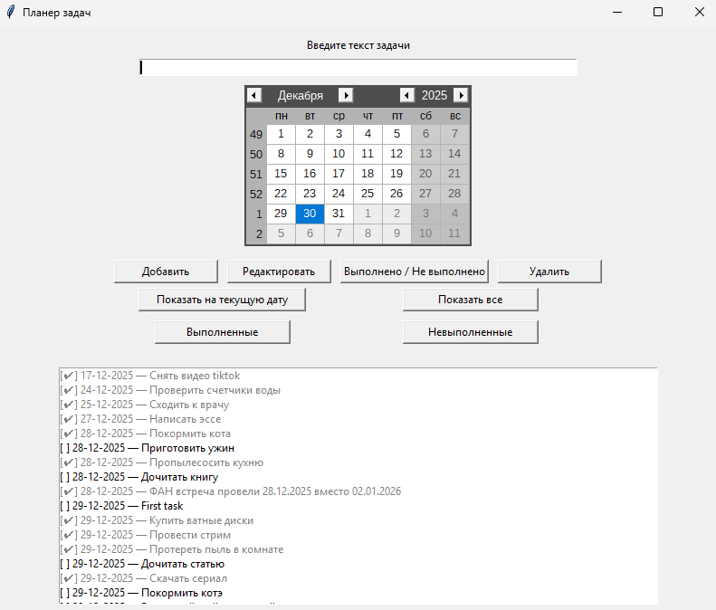
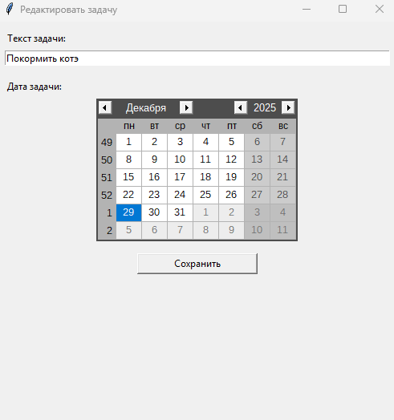

# Планер задач на Tkinter

Простой и удобный планер задач с графическим интерфейсом, написанный на Python с использованием Tkinter.
Позволяет создавать задачи, назначать им даты, редактировать, отмечать выполнение и сохранять данные в файл.

## Скриншоты 



## Возможности

* Добавление задач с текстом и датой

* Редактирование задач в отдельном окне

* Отметка задач "Выполнено"[✔] или "Не выполнено"[ ]

* Удаление задач

* Фильтрация задач по выбранной дате

* Фильтрация по статусу (выполненные / невыполненные)

* Автоматическая сортировка задач по дате (по возрастанию)

* Сохранение задач в файл tasks.json

* Автоматическая загрузка задач при запуске программы

## Интерфейс

* Поле ввода текста задачи

* Календарь для выбора даты

### Кнопки управления:

* Добавить

* Редактировать

* Выполнено / Не выполнено

* Удалить

* Фильтры

### Список задач (Listbox) с отображением:

* статус [✔] или [ ]

* дата

* текст задачи

##  Структура проекта
```
planer.py      # основной файл приложения
tasks.json     # файл для сохранения задач (создается автоматически)
```

## Модель данных

* Каждая задача хранится как словарь:
```
{
  "text": "Купить продукты",
  "date": "28-12-2025",
  "done": false
}
```

* Все задачи хранятся в списке self.tasks и сериализуются в tasks.json.

## Технологии

* Python 3.10+

* Tkinter — графический интерфейс

* tkcalendar — календарь

* json — сохранение данных

* datetime — работа с датами

* os — проверка существования файла

## Установка и запуск

* Клонирование репозитория

```
git clone https://github.com/LucyCat-coder/Planer.git

cd task-planner
```

* Установка зависимостей

```
pip install tkcalendar
```

* Tkinter обычно уже установлен вместе с Python.

## Запуск приложения

```
python planer.py
```

### Формат даты

Используется формат день-месяц-год (dd-mm-yyyy):

```
28-12-2025
```

* Если в tasks.json были старые даты в формате yyyy-mm-dd,
они автоматически конвертируются при загрузке.

## Как работает

* Все задачи хранятся в списке self.tasks

* Listbox используется только для отображения

### При любом изменении:

* данные сохраняются в файл

* список обновляется через refresh_listbox()

* Фильтрация и сортировка выполняются перед отображением

## Возможные улучшения

* Использование уникальных ID для задач вместо сравнения текста

* Добавление времени (часы и минуты)

* Поиск по тексту задач

* Экспорт в CSV / Excel

* Подсказки и напоминания, всплывающие окна

* Иконка приложения и сборка .exe

* Цетовое оформление

* Добаление приоритетов

* Синхронизация с облаком

* Автоматическое планирование

* Аналитика и прогнозирование

* Голосовое управление

* Умные подсказки и напоминания

## Лицензия

#### Проект создан для учебных целей, чтобы практиковаться в:

* Python

* ООП

* Tkinter

* Работе с файлами и датами